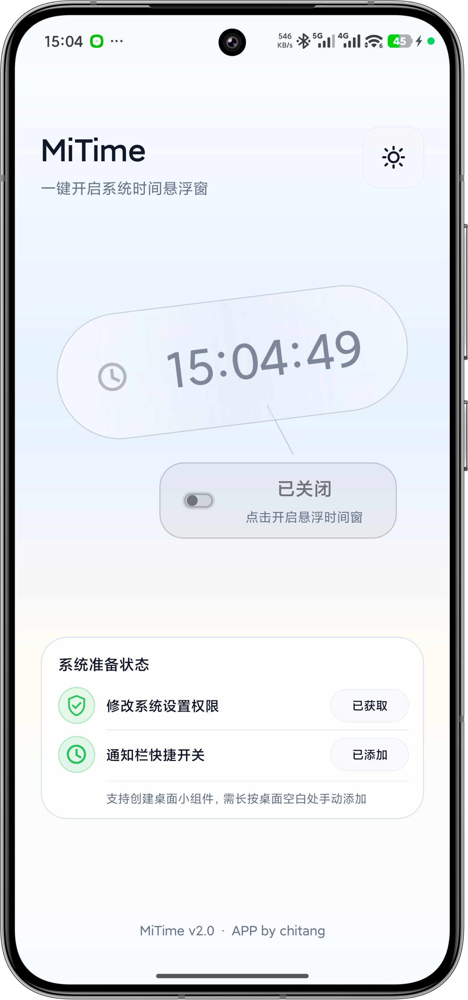
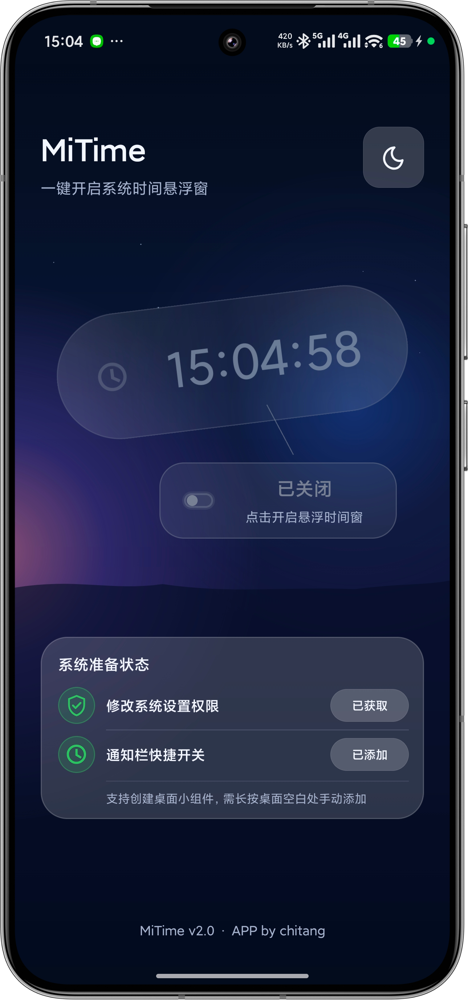
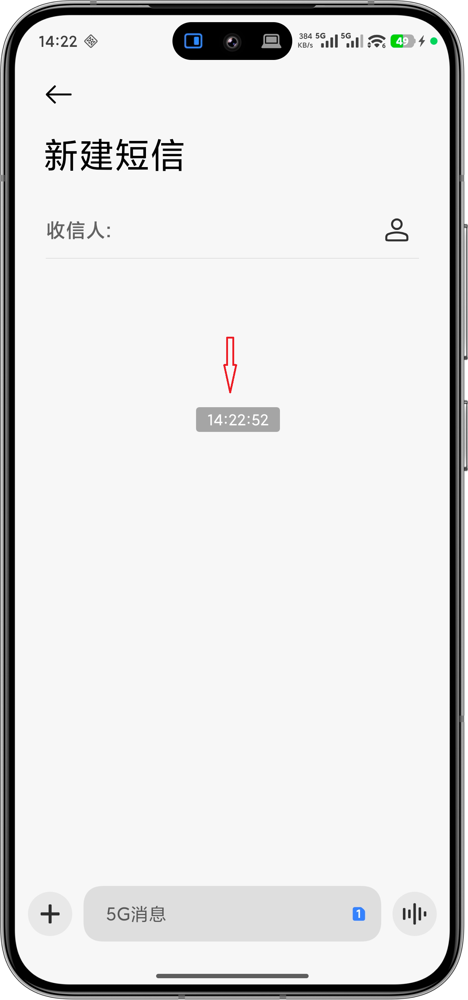
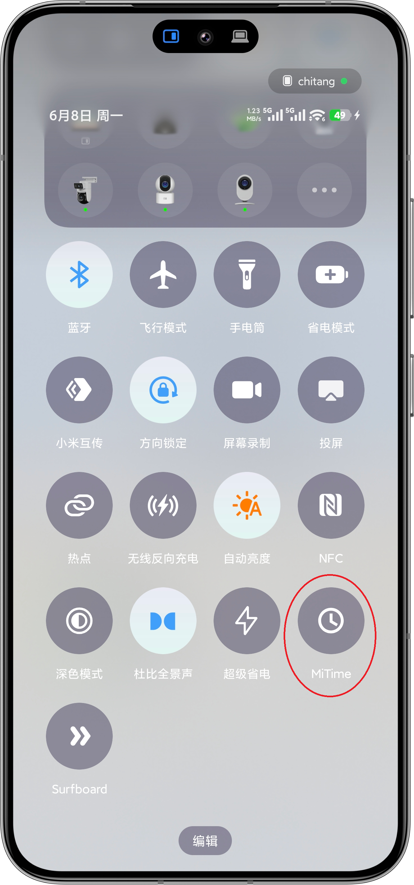

<p align="center">
  
</p>

<h1 align="center">MiTime</h1>

<p align="center">
  <strong>小米 / HyperOS 时间悬浮窗的一键快捷开关</strong>
</p>

<p align="center">
  <a href="#功能亮点">功能亮点</a>
  ·
  <a href="#软件截图">软件截图</a>
  ·
  <a href="#使用方式">使用方式</a>
  ·
  <a href="#构建与安装">构建与安装</a>
</p>

<p align="center">
  
  
  
  
</p>

MiTime 是一款专为搭载 HyperOS 系统的小米与 Redmi 手机量身定制的极简工具 App。它只做一件事：将系统内置但隐藏较深的「时间悬浮窗」开关，转化为 App 主界面、通知栏磁贴及桌面小组件上触手可及的快捷入口。

系统原生路径通常是：设置 -> 更多设置 -> 开发者选项 -> 时间悬浮窗

MiTime 将这条 4 步以上的操作路径缩短为一次点击。

## 软件截图

<table>
  <tr>
    <td align="center">
      
      <br />
      <sub>亮色主界面</sub>
    </td>
    <td align="center">
      
      <br />
      <sub>暗色主界面</sub>
    </td>
    <td align="center">
      
      <br />
      <sub>时间悬浮窗效果</sub>
    </td>
    <td align="center">
      
      <br />
      <sub>通知栏快捷方式</sub>
    </td>
  </tr>
</table>

## 功能亮点

| 功能           | 说明                                                      |
| -------------- | --------------------------------------------------------- |
| 主界面一键切换 | 启动后自动读取系统真实状态，点击即可开启或关闭时间悬浮窗  |
| 状态回读校验   | 每次写入后立即读取系统返回值，避免 UI 与系统状态不一致    |
| 通知栏快捷磁贴 | 支持 Quick Settings Tile，无需进入 App 即可切换           |
| 桌面小组件     | 支持 1x1 图标型和 2x1 文字型 Widget，放在桌面即可快速操作 |
| 权限引导       | 首次使用自动引导开启「修改系统设置」权限                  |
| 轻量离线       | 不声明网络权限，无广告、无埋点、无数据收集                |

## 使用方式

1. 安装并打开 MiTime。
2. 按提示授予「修改系统设置」权限。
3. 在主界面点击开关，即可开启或关闭系统时间悬浮窗。
4. 可选：将 MiTime 添加到通知栏快捷设置，或添加桌面小组件。

## 权限与隐私

MiTime 只申请一项权限：

| 权限               | 用途                                   | 必需 |
| ------------------ | -------------------------------------- | ---- |
| `WRITE_SETTINGS` | 写入系统设置键，控制小米时间悬浮窗开关 | 是   |

MiTime 不需要也不会申请：

| 类型                         | 状态   |
| ---------------------------- | ------ |
| 网络权限                     | 不声明 |
| 位置、存储、联系人等权限     | 不声明 |
| 数据统计、崩溃上报、广告 SDK | 不包含 |
| 后台常驻服务                 | 不使用 |

## 背景与原理

### 原生悬浮窗的绝对优势

市面上有许多第三方悬浮时间 App，但它们往往存在一个痛点：**在部分具有安全防护机制的 App（例如各大银行 App、支付密码输入界面等）中，第三方悬浮窗会因安全策略被强制遮挡或失效。**

而 HyperOS 内置的「时间悬浮窗」属于系统底层功能，**能够无视上述限制，在任何 App 界面之上均可稳定显示**。

### 技术原理

HyperOS 的时间悬浮窗由系统 SystemUI 实现，并不是普通 Android 悬浮窗，因此不依赖 `SYSTEM_ALERT_WINDOW` 权限。它的开关由一个隐藏的系统设置键控制：

```text
Settings.System 键名：miui_time_floating_window
取值：1 = 开启，0 = 关闭
```

MiTime 使用 Android 标准 API 写入该键值：

```java
// 读取当前状态
Settings.System.getInt(contentResolver, "miui_time_floating_window", 0) == 1

// 开启
Settings.System.putInt(contentResolver, "miui_time_floating_window", 1)

// 关闭
Settings.System.putInt(contentResolver, "miui_time_floating_window", 0)
```

权限不足时，App 会引导用户进入系统授权页：

```java
if (!Settings.System.canWrite(context)) {
    Intent intent = new Intent(Settings.ACTION_MANAGE_WRITE_SETTINGS);
    intent.setData(Uri.parse("package:" + context.getPackageName()));
    startActivity(intent);
}
```

已验证设备：

```text
Xiaomi 23127PN0CC / Android 16 / SDK 36 / HyperOS OS3.0
```

## 技术规格

| 项目              | 规格                               |
| ----------------- | ---------------------------------- |
| 包名              | `com.chitang.mitime`             |
| 当前版本          | `2.0`                            |
| minSdkVersion     | 22 (Android 5.1)                   |
| targetSdkVersion  | 22                                 |
| compileSdkVersion | 35                                 |
| APK 大小          | 小于 2 MB                          |
| 支持设备          | 小米 / Redmi /，运行HyperOS 的设备 |
| 主要语言          | 简体中文                           |

> `targetSdkVersion = 22` 是有意保留的兼容策略，用于沿用 HyperOS 对 `WRITE_SETTINGS` 写入私有系统设置键的兼容路径。

## 构建与安装

### 环境要求

- Android Studio，或已配置的 JDK + Android SDK
- Windows PowerShell 或命令提示符
- Android 设备和 ADB 环境，用于调试安装

### 构建 Debug APK

```powershell
.\build.ps1
```

也可以使用 Gradle Wrapper：

```powershell
.\gradlew.bat assembleDebug
```

构建产物位置：

```text
app/build/outputs/apk/debug/MiTime_v2.0_debug.apk
```

### 安装到设备

```powershell
.\install-debug.ps1 -ApkPath .\app\build\outputs\apk\debug\MiTime_v2.0_debug.apk
```

调试安装脚本会在安装成功后尝试授予 `WRITE_SETTINGS`：

```bash
adb shell appops set com.chitang.mitime WRITE_SETTINGS allow
```

如果系统阻止低 target SDK 应用安装，脚本会自动使用 `--bypass-low-target-sdk-block` 重试。

## 项目结构

```text
MiTime/
├── app/
│   ├── src/main/
│   │   ├── java/com/chitang/mitime/
│   │   │   ├── MainActivity.java           # 主界面与交互逻辑
│   │   │   ├── FloatingWindowHelper.java   # 系统设置读写与回读校验
│   │   │   ├── MiTimeTileService.java      # 通知栏快捷磁贴
│   │   │   ├── MiTimeWidget.java           # 2x1 桌面小组件
│   │   │   ├── MiTimeIconWidget.java       # 1x1 桌面小组件
│   │   │   ├── AtmosphereScrollView.java   # 视觉氛围与滚动容器
│   │   │   └── PermissionHelper.java       # 权限检查与系统授权引导
│   │   ├── res/
│   │   │   ├── layout/
│   │   │   ├── drawable/
│   │   │   ├── mipmap-*/
│   │   │   └── xml/
│   │   └── AndroidManifest.xml
│   └── build.gradle
├── docs/
│   └── screenshots/
├── build.ps1
├── install-debug.ps1
└── build.bat
```

## 兼容性备忘

当前方案优先使用 `Settings.System.putInt()` 直接写入，并进行 read-back 校验。如果未来系统策略进一步收紧，可按优先级评估以下方案：

| 优先级 | 方案         | 说明                                               |
| ------ | ------------ | -------------------------------------------------- |
| 1      | 直接写入     | 当前实现，`Settings.System.putInt()` + read-back |
| 2      | Shizuku      | 以 shell UID 执行 `settings put system`          |
| 3      | Root         | root 环境下直接写入系统设置                        |
| 4      | ADB 引导     | 引导用户通过电脑执行一次性授权或命令               |
| 5      | 系统接口探索 | 探索 HyperOS 是否保留可用广播或 Provider 接口      |

## 开源许可

当前仓库未提供 `LICENSE` 文件。如需公开分发或协作开发，建议补充明确的开源许可证。
